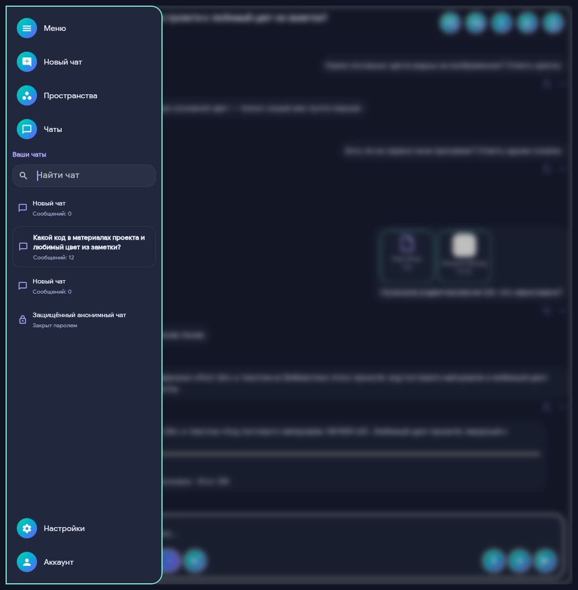
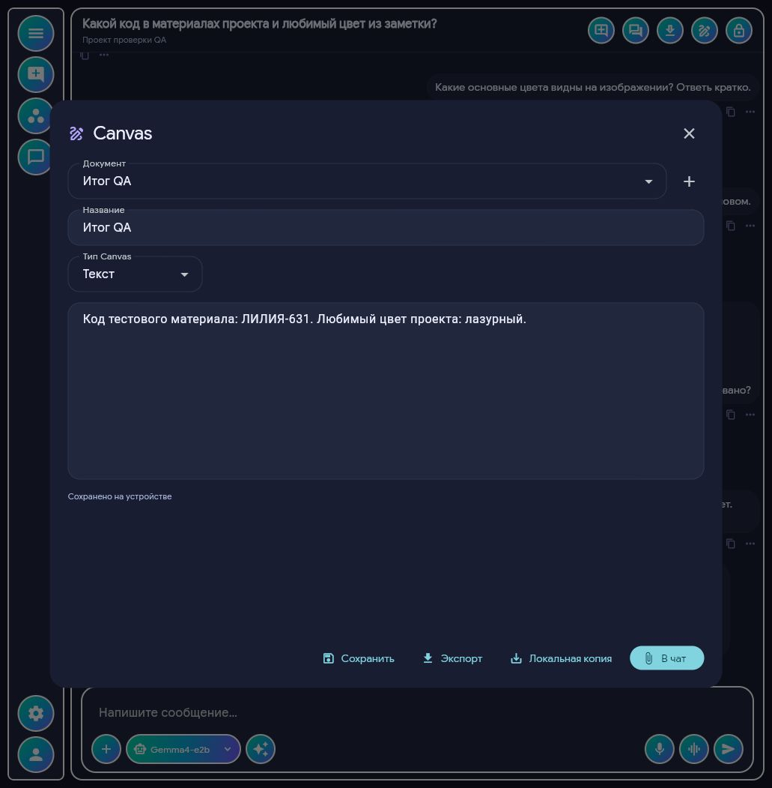
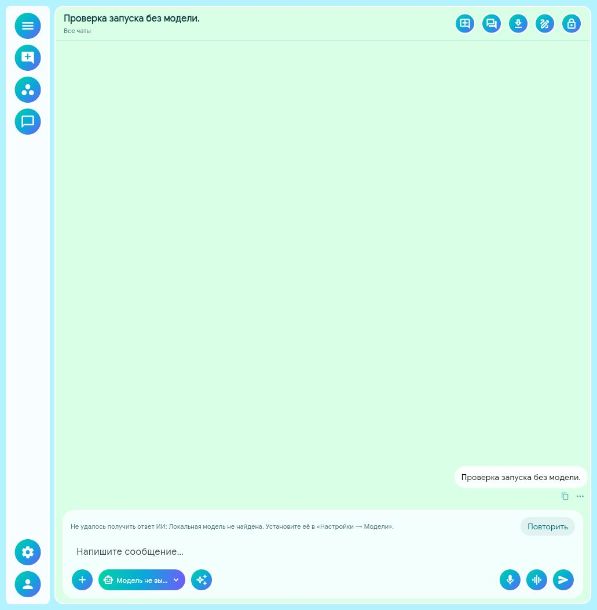
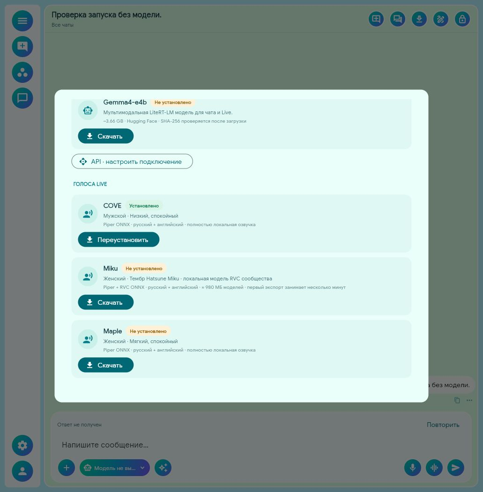

# Проверка чистого Xopilot через интерфейс

Дата: 3 октября 2026. Linux, браузерный клиент того же Flet-приложения. Действия выполнялись через реальные кнопки, поля, выбор файлов и рисование мышью. Ответы — от установленной Gemma4-e2b, без заглушек.

## Условия

- Новый профиль `/tmp/xopilot-clean-20261003-private`: первоначально пустая история, новые настройки и база. Модели и голоса использовались уже установленные; это проверка чистых данных приложения, а не скачивания всех весов заново.
- Отдельный профиль упакованной программы `/tmp/xopilot-clean-package-20261003`, пустой каталог моделей. Запущен байткод и зависимости из `build/linux/` через имеющийся Python 3.14 и веб-транспорт Flet. Это проверка кода пакета через интерфейс, не установка на машину без Python.
- Тестовые тексты, проекты, вложения и пароли созданы только для проверки. Пользовательская база не изменялась.
- Дополнительно непосредственно запущен `build/linux/Xopilot` с третьим новым профилем: база создана; процесс завершён проверкой через 15 секунд. В журнале есть предупреждение ожидания OpenGL-кадра при изменении размера. Полный проход нативного окна здесь не подтверждён.

## Проверенные сценарии

| Сценарий | Результат через интерфейс |
|---|---|
| Первый запуск | Пустой экран без демонстрационных сообщений. |
| Обычный чат | Вопрос 2+2 → «Четыре». Название получено из первого вопроса, история пережила перезапуск сервера. |
| Меню с чатами | Названия, количество сообщений, текущий чат, поиск по названию. Выбор переключает историю; защищённый пункт вызывает пароль. При выбранном проекте показаны его чаты и защищённые чаты. |
| Сохранённый защищённый чат | Создание с отдельным паролем, неверный пароль отклонён, правильный открыл чат. При уходе и перезапуске название скрыто. |
| Приватные вложения | Реальный FilePicker добавил brief.txt; локальная модель назвала код «ЛИЛИЯ-631». |
| Приватный Canvas и черновик | Созданы и сохранены, затем восстановились после блокировки и открытия паролем. |
| Временный защищённый чат | 3+4 → «Семь». Завершение убрало чат; сохранённый и обычные остались. Удаление его файлов дополнительно проверяется тестами. |
| Проект и библиотека | Выбрана иконка кода, сохранены инструкции, импортирован файл и папка, добавлена заметка. Модель ответила «ЛИЛИЯ-631» и «лазурный» из материалов. |
| Новый чат проекта | Создание добавило один новый пункт в меню, без второго пустого чата. |
| Профиль | Карандаш изменил имя, оно сохранилось. Центрированные счётчики показали размер БД; приватные сообщения не вошли в обычный счётчик. |
| Темы | Каталог содержит семь тем; «Полночь» применена к чату, меню, Live и Canvas и пережила перезапуск. |
| Live с файлом | Вложение добавлено; вопрос при выключенном микрофоне получил правильный код из файла. |
| GPU | Окно Live показало «GPU · видеокарта» при реальной генерации. |
| Камера | Предпросмотр 640×480; модель ответила о тёмном кадре. |
| Экран | Предпросмотр рабочего стола; вопрос о наличии окон → «Да». Переключение камеры/экрана и завершение освобождают захват. |
| Canvas: код | Создан `print(2 + 2)`, сохранён и прикреплён как .py. |
| Canvas: рисунок | Нарисованы две линии разных цветов; отмена убрала последнюю. Рисунок сохранился после перезапуска, прикреплён как PNG. |
| Агент «Автоматически» | Реально вызвал создание «Итог QA». Документ открыт: код «ЛИЛИЯ-631», цвет «лазурный». В этой реплике факты уже были в истории; чтение библиотеки агентом не приписывается этому конкретному запросу. |
| Редактирование сообщения | Текст заменён через клавиатуру и сохранён; экспорт содержит исправление. |
| Экспорт Markdown | «Локальная копия» записала полный файл, проверен исправленный текст. |
| Экспорт рисунка | Реальный PNG открыт; после исправления пропорций размер 1200×425 соответствует области рисования. |
| Окно 380×560 | Меню с прокручиваемыми чатами, переключение чата, кнопки ввода и Canvas доступны; временное изменение размера отменено. |
| Пакет без модели | Успешный старт. Отправка/повтор показывают причину отсутствия модели и путь «Настройки → Модели». Повтор не дублирует вопрос. Каталог показывает неустановленные веса и загрузчики. |
| Установка голоса с нуля | Через кнопку «Скачать» в упакованном интерфейсе установлены оба голоса COVE: Ruslan (ru) и Ryan (en). Получены файлы моделей/конфигураций, SHA-256 совпали с каталогом. Повторная установка восстановила отсутствующую конфигурацию; отметка «Установлено» появилась сразу в той же карточке. |

## Исправления, найденные при проходе

- Добавлен список чатов с поиском в раскрытое меню; он обновляется при создании и автоматическом/ручном изменении названия.
- Создание чата из проекта больше не создаёт лишнюю пустую запись перед целевой.
- Блокировка приватного чата корректно освобождается, когда открытие выполнено рабочим потоком, а закрытие — потоком интерфейса.
- Очищаются приватные данные Live и диалогов при выходе и отключении страницы. Поздний результат запроса не становится повтором в обычном чате.
- После аварийного закрытия временные копии очищаются уже при запуске, без необходимости прикреплять новый файл.
- Для встроенного браузера добавлено явное сохранение локальной копии: стандартную загрузку браузера подтвердить не удалось.
- PNG сохраняет пропорции области рисунка вместо растягивания до фиксированного прямоугольника.
- Причина ошибки модели остаётся возле строки ввода после исчезновения уведомления.
- Карточки загрузчика показывают «Загрузка…» во время операции и сразу обновляют отметку «Установлено» после её завершения; для голоса выводится текущая модель ru/en.

## Автоматические проверки и сборка

Последний проход: **185 Python-тестов**, **4 Rust-теста**, `cargo check --offline`, `git diff --check` — успешно. Linux-сборка `flet build linux --yes --python-version 3.14 --no-rich-output` завершилась успешно после последних изменений. В пакет входят cryptography/filelock, защищённое хранилище, Canvas и локальный экспорт.

Проверены неправильный пароль, подмена шифротекста, изоляция API/проектов/статистики, отсутствие записи временного текста на диск, очистка рабочих вложений, сохранность оригиналов, конкурирующие окна, работа блокировок между потоками, откат при ошибках записи и поздний ответ после отключения.

## Что ещё требует другой среды или отдельной проверки

- Windows: сборка, камера/экран/звук, нативный выбор файлов и права доступа.
- Полная чистая установка без Python и скачивание всех тяжёлых моделей с последующим инференсом; Gemma4-e4b на этом компьютере не установлена.
- В этом новом проходе Live проверялся текстовыми вопросами с выключенным микрофоном/озвучиванием. Реальный ввод звука и озвучивание описаны в [предыдущем протоколе](USER_CHECKS.md) и [проверках Miku](MIKU_VOICE.md).
- Внешний API с настоящим пользовательским ключом; автоматические проверки используют локальный HTTP-сервер.
- Получение стандартной браузерной загрузки и весь нативный FilePicker; локальная копия экспорта проверена.
- Длинные диалоги на границе контекста, длительный разговор и системные сценарии keyring.

Камера и экран отправляют кадр каждого вопроса, а не непрерывное видео. Защищённый режим имеет [явные границы защиты](PRIVATE_CHATS.md); это не обещание физического стирания или защиты открытого процесса от администратора ОС.
